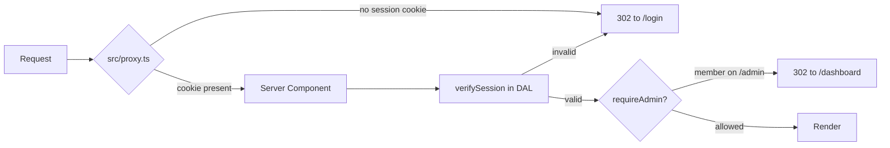

# AEGIS — Database & Auth

Reference for the control plane: how accounts, sessions, tenants, and module
entitlements are stored and enforced. Written after Phase 1 of the backend
integration.

**Status:** auth, users, businesses, entitlements, **bookings** and the
**revenue ledger** are real and persisted, and dashboard revenue aggregates over
the ledger. Everything else on the dashboard (balance, expenses, net profit,
bookings mix, ads, alerts) and all of Mail still run on static fixtures in
`src/lib/data/*.ts`.

---

## 1. Environment

`.env.local` (see `.env.local.example`):

| Variable | Purpose |
|---|---|
| `MONGODB_URI` | Connection string, e.g. `mongodb://localhost:27017` |
| `MONGODB_DB_NAME` | Database name — `aegis` |
| `AUTH_SECRET` | Signs the session JWT. **NextAuth v5 reads `AUTH_SECRET`**, not the v4 `NEXTAUTH_SECRET`. Generate with `npx auth secret`. |

The old `NEXTAUTH_*` and `GOOGLE_CLIENT_*` variables were removed — the design
has no SSO, so nothing read them.

---

## 2. Database

### Connection

One cached `MongoClient`, exported from `src/lib/db/mongodb.ts`. The promise is
stashed on `globalThis` in development so hot reloads reuse a single connection
pool instead of opening one per module re-evaluation.

`mongoose` was removed. Two data-access libraries for one database is a smell,
and the old `src/lib/db/mongoose.ts` cached a single global connection with
`dbName` pinned to an env var — it could never have supported per-tenant work.

### Isolation model

**One database, `businessId` on every tenant-owned document.** This was chosen
over a database per tenant for simpler operations and cheap cross-tenant admin
queries. The trade-off is explicit: a forgotten filter is a data-leak path.
Section 5 describes the mitigation.

### Collections

All three below are **control plane** — they span tenants and carry no
`businessId`.

#### `users`

```
_id                ObjectId
username           string   lowercased, unique
email              string
name               string
passwordHash       string   "scrypt$<saltHex>$<hashHex>"
role               "aegis_admin" | "member"
defaultBusinessId  string   fallback tenant, e.g. "BIZ-1001"
createdAt          Date
```

Index: `{ username: 1 }` unique.

#### `businesses`

```
_id         ObjectId
businessId  string    "BIZ-1001", the public id used in URLs, unique
name        string
meta        string    "Industry · Plan", the row subtitle
onboarded   string
modules     string[]  granted optional modules: bookings | inventory | crm | fleet
status      "active" | "suspended"
```

Index: `{ businessId: 1 }` unique.

`modules` is the entitlement grant that Business Management edits. Core modules
(Dashboard, Mail, Ads) are **not** stored here — they are constants in
`src/lib/data/businesses.ts` and always on.

#### `memberships`

```
_id         ObjectId
userId      string    stringified users._id
businessId  string
```

Index: `{ userId: 1, businessId: 1 }` unique.

This is what a `member` may switch between. An `aegis_admin` bypasses it and
reaches every business.

#### `bookings` — tenant-owned

The first collection that carries `businessId`, and the first consumer of
`tenantScope()`.

```
_id              ObjectId
businessId       string    stamped on by tenantScope, never by a call site
ref              string    "BK-8254", unique per business
customer         string
company          string
email            string
service          string
startsAt         Date      source of truth for ordering and range filtering
durationMinutes  number
staff            string
valueCents       number
status           "Confirmed" | "Pending" | "In progress" | "Completed" | "Cancelled"
channel          string
notes            string
createdAt        Date
```

Indexes: `{ businessId: 1, ref: 1 }` unique, and `{ businessId: 1, startsAt: 1 }`
for range queries.

Times are stored as real `Date`s. The display strings the UI renders (`day`,
`time`, `duration`) are derived **on the server** in `src/lib/dal/bookings.ts` —
deriving them in the browser would format against the visitor's timezone and
mismatch the server-rendered HTML.

#### `transactions` — tenant-owned, the revenue ledger

Revenue is never a stored number on a business or a booking; it is always an
aggregation over this collection. That is what lets the dashboard be correct for
any combination of modules a business has switched on — Bookings feeds it today,
Inventory and CRM can feed it later without the dashboard changing.

```
_id          ObjectId
businessId   string    stamped on by tenantScope
source       "bookings" | "inventory" | "crm" | "manual"
sourceRef    string    the originating record, e.g. "BK-8241"
occurredAt   Date      when the revenue belongs, not when the row was written
amountCents  number
status       "recognised" | "void"
description  string
createdAt    Date
updatedAt    Date
```

Indexes: `{ businessId: 1, source: 1, sourceRef: 1 }` unique — one entry per
source record, which is what makes posting idempotent — and
`{ businessId: 1, status: 1, occurredAt: 1 }` for the range aggregations.

**Recognition rule:** an entry is posted the moment a booking is created, and
cancelling **voids** it rather than deleting it, so the cancellation stays
auditable and the amount is still visible. Only `recognised` entries count.

**Consistency:** the local Mongo is a standalone, so there are no
multi-document transactions and a booking plus its ledger entry cannot be
written atomically. The booking is the system of record; the entry is derived
and upserted idempotently on `(source, sourceRef)`.

Drift is therefore possible in both directions, and both are repairable:

```bash
npm run reconcile           # report only, changes nothing
npm run reconcile -- --fix  # apply the repairs
```

`scripts/reconcile.ts` compares the two collections and reports three kinds of
drift — entries whose booking was deleted (**orphans**, which keep counting
toward revenue until voided), bookings with no entry, and entries whose amount,
date or cancellation disagrees with their booking. Orphans are **voided, not
deleted**, so the record stays auditable.

Unlike `npm run seed`, this never writes to the bookings collection, so it is
safe on real data. `reconcileBookings()` in `src/lib/dal/ledger.ts` does the
same repair from inside a request.

### Seeding

```bash
npm run seed
```

Runs `scripts/seed.ts` via `node --env-file=.env.local` (Node 24 strips the
types natively). It creates the indexes and upserts the fixtures from
`src/lib/data/businesses.ts`.

It is **idempotent and non-destructive**: business `modules` and user
`passwordHash` are written with `$setOnInsert`, so re-running never undoes an
entitlement an admin granted in the app or resets a changed password.

There is currently **one tenant, AUTOBLITZ** (`BIZ-1001`), with Bookings,
Inventory and CRM granted. The earlier placeholder businesses were deleted.

Seeded accounts — password `aegis-demo` for both:

| Username | Role | Sees |
|---|---|---|
| `ahmed.ben` | `aegis_admin` | Every business, plus Business Management |
| `rosa.marin` | `member` | AUTOBLITZ only, no Internal section |

> `src/lib/data/businesses.ts` is **seed input only** — no screen imports the
> `BUSINESSES` array. It still exports `CORE_MODULES`, `OPTIONAL_MODULES`, and
> `ACCOUNT_PAGES`, which are static config legitimately shared with the client.

---

## 3. Authentication

NextAuth v5 (`next-auth@^5.0.0-beta.32`), Credentials provider only.

**No `@auth/mongodb-adapter`.** Two reasons: it peer-requires `mongodb ^6`
against the installed 7.5.0, and Auth.js forces the JWT session strategy when
Credentials is in play — so the adapter would never store a session. The
`users` collection is ours.

### Files

| File | Role |
|---|---|
| `src/auth.ts` | `NextAuth({...})` → exports `handlers`, `signIn`, `signOut`, `auth` |
| `src/app/api/auth/[...nextauth]/route.ts` | Mounts `handlers` as `GET`/`POST` |
| `src/types/next-auth.d.ts` | Adds `role` and `defaultBusinessId` to `User`, `Session`, `JWT` |
| `src/lib/auth/password.ts` | `hashPassword` / `verifyPassword` |
| `src/app/login/page.tsx` | Renders the form; redirects if already signed in |
| `src/app/actions/auth.ts` | `signInAction`, `signOutAction` |

> **Gotcha:** the JWT augmentation must target `@auth/core/jwt`, not
> `next-auth/jwt`. The latter is only `export * from "@auth/core/jwt"` and
> declares no interface, so augmenting it silently creates an unrelated type
> and every custom claim resolves to `unknown`.

### Passwords

`node:crypto` `scrypt` — no dependency and no native build on Windows.
Per-user 16-byte random salt, 64-byte derived key, stored as
`scrypt$<saltHex>$<hashHex>`, compared with `timingSafeEqual`.

### Session

Stateless JWT in an httpOnly cookie — `authjs.session-token`, or
`__Secure-authjs.session-token` over HTTPS. Claims: `sub` (user id), `role`,
`defaultBusinessId`.

The active business is deliberately **not** a JWT claim; putting it there would
force a token re-issue on every switch. See section 4.

### Sign-in flow

1. `login-screen.tsx` submits to `signInAction` via `useActionState`.
2. The action calls `signIn("credentials", { redirect: false })`.
3. `authorize()` in `src/auth.ts` calls `authenticate()` from
   `src/lib/dal/users.ts`, which looks the user up and verifies the hash.
4. On success the action calls `redirect("/dashboard")` — **outside** the
   try/catch, because `redirect()` signals by throwing and the catch would
   swallow it.
5. On failure it returns one deliberately vague message. Distinguishing "no
   such user" from "wrong password" would tell an attacker which usernames
   exist.

---

## 4. Authorization

### Roles

- **`aegis_admin`** — AEGIS staff. Sees every business in the switcher, sees
  the sidebar's Internal section, and can reach `/admin/*`.
- **`member`** — a customer. Sees only the businesses they hold a membership
  for. No Internal section, no admin row in the switcher, and `/admin/*`
  redirects to `/dashboard`.

### Active business

Held in an httpOnly cookie, `aegis.active_business`:

```
httpOnly: true, sameSite: "lax", path: "/",
secure: NODE_ENV === "production", maxAge: 30 days
```

Written **only** by `switchBusinessAction` (`src/app/actions/business.ts`),
which checks membership before writing.

Because a cookie is attacker-controlled input, it is checked **again on every
request** in `resolveActiveBusiness` (`src/lib/dal/session.ts`) against
`allowedBusinessIds()`, falling back to `defaultBusinessId` when it does not
hold up. A tampered cookie therefore grants nothing — verified by minting a
member session and replaying a request carrying another tenant's id.

### Two layers of route protection



**`src/proxy.ts`** — Next 16 renamed `middleware.ts` to `proxy.ts`. This is an
*optimistic* check only: it tests for the presence of the session cookie so
signed-out visitors bounce without a database round trip. It does **not**
verify the token. The matcher excludes `api/auth`, `login`, and static assets.

**The DAL** — where every real decision is made, as the Next docs recommend.
Hiding a link is not access control: `/admin/businesses` calls `requireAdmin()`
server-side regardless of what the sidebar renders.

---

## 5. The DAL contract

`src/lib/dal/` — every file marked `server-only`. **This is the only code that
touches the database.**

| File | Exports |
|---|---|
| `db.ts` | `getDb()`, typed collection accessors. Not imported outside `src/lib/dal`. |
| `session.ts` | `verifySession()`, `optionalSession()`, `requireAdmin()`, `allowedBusinessIds()` |
| `users.ts` | `authenticate()`, `findUserById()`, `membershipBusinessIds()` |
| `businesses.ts` | `listBusinessesForUser()`, `getBusinessForUser()`, `setModuleGrants()`, `getActiveBusiness()`, `requireModule()` |
| `bookings.ts` | `listBookings()`, `getBooking()`, `createBooking()`, `setBookingStatus()`, `rescheduleBooking()`, `recognisedRevenueCents()` |
| `ledger.ts` | `postEntry()`, `setEntryStatus()`, `revenueBetween()`, `revenueByMonth()`, `reconcileBookings()` |
| `tenant.ts` | `tenantScope()` — see below |

`verifySession()` is wrapped in React `cache()`, so a layout and the page inside
it share one session lookup per render pass instead of two.

### Rules when adding data access

1. **Never import `mongodb` or `getDb()` from a screen.** Add a DAL function.
2. **Call `verifySession()` first** in every DAL read. `authenticate()` is the
   one exception — there is no session yet during sign-in.
3. **Assert the role for privileged writes.** `setModuleGrants()` calls
   `requireAdmin()` before it writes.
4. **Reach tenant-owned collections only through `tenantScope()`.**
5. **Return DTOs, not documents.** `_id` and `passwordHash` never leave the DAL.

### `tenantScope()`

The mitigation for the single-database choice. Given a collection name it
returns a wrapper that merges `{ businessId }` into every filter, stamps it onto
inserts, and prepends a `$match` to aggregations that callers cannot opt out of.

```ts
const bookings = await tenantScope<BookingDocument>("bookings");
await bookings.find({ status: "Confirmed" }).toArray(); // scoped automatically
```

`src/lib/dal/bookings.ts` is the reference implementation: every read, write and
aggregation for bookings goes through it, and no call site anywhere passes a
`businessId` by hand. `transactions` should follow the same pattern.

### `requireModule()`

Server Actions that write to a module call `requireModule("bookings")` first.
The sidebar dims a locked module and the page renders an explainer, but neither
of those stops a hand-crafted POST — this does.

---

## 6. Local runbook

```bash
npm install
```

Populate `.env.local` from `.env.local.example`, then:

```bash
npm run seed
```

```bash
npm run dev
```

Sign in at `/login` with `ahmed.ben` / `aegis-demo`.

To inspect what is stored, open a Mongo shell against `MONGODB_URI` and read the
`businesses` collection — `businessId` and `modules` are the two fields that
show entitlement state.

---

## 7. Known gaps

- **No password reset, MFA, invitations, or rate limiting on sign-in.**
- **No Add Business flow** — the button exists but is inert.
- **`status: "suspended"` is stored but never enforced.** A suspended business
  still resolves and renders.
- **Booking refs are allocated by reading the current maximum.** Concurrent
  creates race; the unique index turns that into a write error and
  `createBooking` retries, but a counter document would be tidier under load.
- **Reconciliation is manual.** `npm run reconcile -- --fix` repairs ledger
  drift, but nothing runs it automatically and no UI triggers it. Worth a
  scheduled job or an admin action once this is handling real money.
- **Deleting a booking outside the app leaves an orphan entry** that keeps
  counting toward revenue until the next reconcile. The app's own delete path
  would void it; a manual `deleteOne` in a Mongo shell will not.
- **Only revenue is in the ledger.** Expenses, balance and net profit on the
  dashboard are still invented, because no module produces expense entries yet.
  The Revenue Overview chart's "Expense" legend is therefore decorative.
- **No double-entry.** Entries are single-sided credits. Real accounting would
  want a matching debit and an account dimension.
- **Sessions cannot be revoked.** JWTs are stateless, so a stolen token stays
  valid until it expires. Server-side revocation needs a sessions collection.
- **Entitlement changes apply on next request, not next sign-in.** The admin
  screen's copy still says "at next sign-in", which is now more conservative
  than the actual behaviour — `revalidatePath` pushes it through immediately.
- **No audit trail** on entitlement changes.
