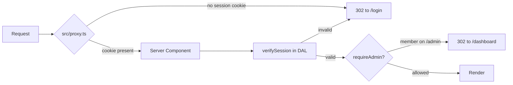

# AEGIS — Database & Auth

Reference for the control plane: how accounts, sessions, tenants, and module
entitlements are stored and enforced. Written after Phase 1 of the backend
integration.

**Status:** auth, users, businesses, entitlements, **bookings**, the **revenue
ledger**, **inventory**, **mail** and **ads** are real and persisted, and
dashboard revenue aggregates over the ledger. **Mail can now retrieve and send
over IMAP/SMTP** against a company mailbox connected per business in Business
Management; until one is connected it runs on the seeded sample inbox and every
status surface reports it as disconnected. **Ads can now read a Meta ad
account, read-only**, connected per business in Business Management; until one
is connected the Ads screen shows the seeded sample rows, labelled DEMO DATA. What remains static fixture in `src/lib/data/*.ts` is the rest of the
dashboard — balance, expenses, net profit, bookings mix and alerts — because no
module produces expense entries yet.

---

## 1. Environment

`.env.local` (see `.env.local.example`):

| Variable | Purpose |
|---|---|
| `MONGODB_URI` | Connection string, e.g. `mongodb://localhost:27017` |
| `MONGODB_DB_NAME` | Database name — `aegis` |
| `AUTH_SECRET` | Signs the session JWT. **NextAuth v5 reads `AUTH_SECRET`**, not the v4 `NEXTAUTH_SECRET`. Generate with `npx auth secret`. |
| `MAIL_CREDENTIAL_KEY` | 32 bytes of hex (`openssl rand -hex 32`). Encrypts stored credentials at rest: mailbox app passwords **and Meta access tokens**. Rotating it makes every stored credential unreadable — each mailbox and Meta account must be reconnected. |

There are no Meta environment variables. An ad account is connected per business
in Business Management, like a mailbox. `META_ACCESS_TOKEN` and
`META_AD_ACCOUNT_ID` in an old `.env.local` are ignored, except by
`npm run ads:check -- --env`, which uses them for a read-only rehearsal.

The old `NEXTAUTH_*` and `GOOGLE_CLIENT_*` variables were removed — the design
has no SSO, so nothing read them.

---

## 2. Database

### Connection

One cached `MongoClient`, exported from `src/lib/db/mongodb.ts`. The promise is
stashed on `globalThis` in development so hot reloads reuse a single connection
pool instead of opening one per module re-evaluation.

`mongoose` was removed. Two data-access libraries for one database is a smell,
and the old `src/lib/db/mongoose.ts` cached a single global connection with
`dbName` pinned to an env var — it could never have supported per-tenant work.

### Isolation model

**One database, `businessId` on every tenant-owned document.** This was chosen
over a database per tenant for simpler operations and cheap cross-tenant admin
queries. The trade-off is explicit: a forgotten filter is a data-leak path.
Section 5 describes the mitigation.

### Collections

Twelve in all. The first three — `users`, `businesses` and `memberships` — are
**control plane**: they span tenants and carry no `businessId`. Every collection
after them is **tenant-owned**, carries `businessId`, and is reached only
through `tenantScope()` (§5).

#### `users`

```
_id                ObjectId
username           string   lowercased, unique
name               string
passwordHash       string   "scrypt$<saltHex>$<hashHex>"
role               "aegis_admin" | "member"
defaultBusinessId  string   fallback tenant, e.g. "BIZ-1001"
createdAt          Date
createdBy          string?  id of the administrator who made it; absent on seeded accounts
```

Index: `{ username: 1 }` unique.

Accounts carry no email address. Older records may still hold an `email`
field from before it was dropped; nothing reads it.

#### `businesses`

```
_id         ObjectId
businessId  string    "BIZ-1001", the public id used in URLs, unique
name        string
meta        string    "Industry · Plan", the row subtitle
onboarded   string
modules     string[]  granted optional modules: bookings | inventory | crm | fleet
status      "active" | "suspended"
```

Index: `{ businessId: 1 }` unique.

A connected mailbox is stored here too, as `mailbox`:

```
mailbox.address       string  the address AEGIS signs in to and sends from
mailbox.secretCipher  string  the Gmail app password, AES-256-GCM encrypted
mailbox.updatedAt     Date
```

Absent until an admin connects one. The password is encrypted by
`src/lib/auth/secrets.ts` under `MAIL_CREDENTIAL_KEY`, so a database dump on its
own yields nothing usable. It is decrypted only in `src/lib/dal/mailbox.ts`, at
the moment a connection is opened, and no read path returns it to a browser —
the admin screen is served `MailboxStatus`, which has no field for a secret.

A connected Meta ad account is stored here as `metaAds`:

```
metaAds.adAccountId   string        "act_" + digits
metaAds.secretCipher  string        the access token, AES-256-GCM encrypted
metaAds.accountName   string        read from Meta on connect and on each test
metaAds.currency      string        ISO 4217, e.g. "PHP"; every amount is in it
metaAds.timezone      string
metaAds.canWrite      boolean|null  the token also holds ads_management
metaAds.updatedAt     Date
```

Same rules as the mailbox: encrypted under `MAIL_CREDENTIAL_KEY`, decrypted only
in `src/lib/dal/ad-account.ts` at the moment a request is made, and never
returned to a browser — screens are served `MetaAdsStatus`, which has no field
for a secret. The token is checked against Meta before it is stored, so a wrong
token or account id is reported when it is typed, not later.

`modules` is the entitlement grant that Business Management edits. Core modules
(Dashboard, Mail, Ads) are **not** stored here — they are constants in
`src/lib/data/businesses.ts` and always on.

#### `memberships`

```
_id         ObjectId
userId      string    stringified users._id
businessId  string
```

Index: `{ userId: 1, businessId: 1 }` unique.

This is what a `member` may switch between. An `aegis_admin` bypasses it and
reaches every business.

#### `bookings` — tenant-owned

The first collection that carries `businessId`, and the first consumer of
`tenantScope()`.

```
_id              ObjectId
businessId       string    stamped on by tenantScope, never by a call site
ref              string    "BK-8254", unique per business
customer         string
company          string
email            string
service          string
startsAt         Date      source of truth for ordering and range filtering
durationMinutes  number
staff            string
valueCents       number
status           "Confirmed" | "Pending" | "In progress" | "Completed" | "Cancelled"
channel          string
notes            string
source           { campaignId, campaignName } | absent   the Meta campaign it came from
createdAt        Date
```

Indexes: `{ businessId: 1, ref: 1 }` unique, and `{ businessId: 1, startsAt: 1 }`
for range queries.

`source` is the **Ad source** picked on the New Booking form, from the Meta
campaigns AEGIS has synced; absent means "not from an ad". The server checks the
id against the synced account before storing it. The campaign name is copied on
so a booking still reads correctly if the campaign is later removed from Meta.
It is what the Ads screen counts bookings and cost per booking on.

Times are stored as real `Date`s. The display strings the UI renders (`day`,
`time`, `duration`) are derived **on the server** in `src/lib/dal/bookings.ts` —
deriving them in the browser would format against the visitor's timezone and
mismatch the server-rendered HTML.

#### `transactions` — tenant-owned, the revenue ledger

Revenue is never a stored number on a business or a booking; it is always an
aggregation over this collection. That is what lets the dashboard be correct for
any combination of modules a business has switched on — Bookings feeds it today,
Inventory and CRM can feed it later without the dashboard changing.

```
_id          ObjectId
businessId   string    stamped on by tenantScope
source       "bookings" | "inventory" | "crm" | "manual"
sourceRef    string    the originating record, e.g. "BK-8241"
occurredAt   Date      when the revenue belongs, not when the row was written
amountCents  number
status       "recognised" | "void"
description  string
createdAt    Date
updatedAt    Date
```

Indexes: `{ businessId: 1, source: 1, sourceRef: 1 }` unique — one entry per
source record, which is what makes posting idempotent — and
`{ businessId: 1, status: 1, occurredAt: 1 }` for the range aggregations.

**Recognition rule:** an entry is posted the moment a booking is created, and
cancelling **voids** it rather than deleting it, so the cancellation stays
auditable and the amount is still visible. Only `recognised` entries count.

**Consistency:** the local Mongo is a standalone, so there are no
multi-document transactions and a booking plus its ledger entry cannot be
written atomically. The booking is the system of record; the entry is derived
and upserted idempotently on `(source, sourceRef)`.

Drift is therefore possible in both directions, and both are repairable:

```bash
npm run reconcile           # report only, changes nothing
npm run reconcile -- --fix  # apply the repairs
```

`scripts/reconcile.ts` compares the two collections and reports three kinds of
drift — entries whose booking was deleted (**orphans**, which keep counting
toward revenue until voided), bookings with no entry, and entries whose amount,
date or cancellation disagrees with their booking. Orphans are **voided, not
deleted**, so the record stays auditable.

Unlike `npm run seed`, this never writes to the bookings collection, so it is
safe on real data. `reconcileBookings()` in `src/lib/dal/ledger.ts` does the
same repair from inside a request.

#### `messages` — tenant-owned

The inbox. One document per email, holding both the message as it arrived and
the model's reading of it, so a screen renders from a single read.

```
_id              ObjectId
businessId       string       stamped on by tenantScope
messageId        string       stable per tenant; becomes the Gmail message id
from             string       sender display name
email            string       sender address
category         string       one of the ten checklist categories, model-assigned
subject          string
time             string       short list form — "09:42", "Yesterday", "Mon"
date             string       long detail form — "May 31, 2026 · 09:42 AM"
priority         "Urgent" | "High" | "Normal" | "Low"
unread           boolean
aiSummary        string       one or two sentences
actionItems      string[]     at most three, each under six words
body             string[]     one entry per paragraph of the original
replies          string[]     suggested reply options
deadline         string|null  as the email worded it; null renders "None mentioned"
needsApproval    boolean      the message asks the business to commit to something
approvalReason   string       one short phrase; empty when needsApproval is false
aiGeneratedAt    Date|null    null while the AI fields are still seeded samples
aiPromptVersion  number|null  which prompt produced them
receivedAt       Date
createdAt        Date
```

Indexes: `{ businessId: 1, messageId: 1 }` unique — the idempotency key that
stops a re-poll of the mailbox inserting the same email twice — and
`{ businessId: 1, receivedAt: -1 }` for the newest-first list.

`aiPromptVersion` is a cost control rather than bookkeeping. Triage skips any
message already analysed at the current `PROMPT_VERSION`, so re-running never
re-bills for work already done. Bumping that version in
`src/lib/ai/mail-triage-prompt.ts` re-triages every message in every tenant, and
is the most expensive single action available in this system.

`deadline` is `null` unless the email states one in its own words; nothing in
the pipeline infers, calculates or rounds a date. `needsApproval` is what routes
a commitment — a charge, a price, a contract, a payment confirmation — to a
person, and when it is true the suggested replies may not accept on the
business's behalf.

#### `aiOutputs` — tenant-owned

Every generation the model has already produced, keyed by a hash of its exact
inputs. A hit here means no request, no tokens and no latency.

```
_id            ObjectId
businessId     string   stamped on by tenantScope
kind           "dashboard-insight" | "ads-insight" | "mail-triage"
               | "compose-draft" | "mail-reply"
cacheKey       string   hash of the exact model inputs
promptVersion  number   invalidates the whole partition when a prompt is rewritten
payload        object   the validated result, as stored
model          string
createdAt      Date
```

Index: `{ businessId: 1, kind: 1, cacheKey: 1 }` unique.

This collection holds summaries of a tenant's mail, so it is read through
`tenantScope()` like any other tenant-owned data — one business must never read
another's cached output.

#### `aiUsage` — tenant-owned

One row per billable call, written whatever the outcome. A call that failed
after the model had already produced tokens still cost money, and a spend
investigation that only sees successes is worse than useless.

```
_id           ObjectId
businessId    string   stamped on by tenantScope
kind          same four values as aiOutputs.kind
model         string
inputTokens   number
outputTokens  number
totalTokens   number
latencyMs     number
outcome       "ok" | "not-configured" | "over-budget" | "timeout"
                   | "rate-limited" | "unusable" | "error"
period        string   "2026-08" — makes the monthly cap one indexed equality match
createdAt     Date
```

Index: `{ businessId: 1, period: 1 }`.

`period` exists so the monthly token cap
(`OPENAI_MONTHLY_TOKEN_BUDGET`, default 200,000, in `src/lib/ai/client.ts`) is a
single indexed lookup rather than a scan. Once the cap is reached the outcome
`over-budget` is recorded and no request is sent. This collection is also the
data behind the OpenAI row of the system-status screen: every call already
carries its outcome, latency and token count.

#### `inventoryItems` — tenant-owned

```
_id            ObjectId
businessId     string   stamped on by tenantScope
sku            string   unique per business
name           string
category       string
icon           string
onHand         number   derived from stockMoves, stored for read speed
target         number
reorder        number   the level at which the item reads as low stock
unit           string
location       string
supplier       string
unitCostCents  number
createdAt      Date
updatedAt      Date
```

Index: `{ businessId: 1, sku: 1 }` unique.

`onHand` is a cached total, not the source of truth. The movement history in
`stockMoves` is, and the two are reconciled the same way bookings and the ledger
are.

#### `stockMoves` — tenant-owned

The audit trail behind `onHand`. Nothing edits a quantity directly; stock
changes by recording a move.

```
_id              ObjectId
businessId       string   stamped on by tenantScope
ref              string   "SM-1043", unique per business
sku              string
kind             "in" | "out"
quantity         number   always positive; kind carries the direction
reason           string   "Goods received", "Picked for booking", …
documentRef      string   delivery note or booking reference, as typed
party            string   supplier or customer; empty on internal moves
unitAmountCents  number
amountCents      number
createdItem      boolean  true when this move brought the item into existence
occurredAt       Date
createdAt        Date
```

Indexes: `{ businessId: 1, ref: 1 }` unique, and
`{ businessId: 1, sku: 1, occurredAt: -1 }` for an item's history.

Only outward moves that are sales post to the revenue ledger, through
`postEntry()` in `src/lib/dal/ledger.ts`. Goods received are a cost, and there is
no cost ledger yet, so posting them would inflate revenue — see §7.

#### `adRows` — tenant-owned

Campaigns, ad sets and ads in one collection. The table and the drawer render
all three tiers identically, so one shape serves them; `level` and `parent`
place a row in the hierarchy.

```
_id           ObjectId
businessId    string   stamped on by tenantScope
id            string   unique per business; the Meta object id for Meta rows
source        "meta" | "sample"   absent on rows seeded before it existed = sample
level         "campaigns" | "adsets" | "ads"
name          string
parent        string   name of the row one tier up; empty for campaigns
objective     string
state         "Active" | "Learning" | "In review" | "Paused" | "Rejected" | "Completed"
enabled       boolean  the row's own switch; off shows as Paused whatever state says
budgetType    "Daily" | "Lifetime" | ""   empty at the ad tier, budget is inherited
budgetCents   number
spendCents    number
results       number
resultLabel   string   what a result means here — "leads", "purchases", "link clicks"
roas          number
reach         number
impressions   number
audience      string
placements    string
schedule      string
learning      string   the delivery note — learning phase, rejection reason
optimization  string
format        string
primary       string   creative body text
headline      string
cta           string
metrics       { last_7d, last_30d, maximum }   Meta rows only; each holds
              spendCents, results, resultLabel, roas, reach, impressions
createdAt     Date
updatedAt     Date
```

Indexes: `{ businessId: 1, id: 1 }` unique, `{ businessId: 1, level: 1 }` for
the tier tabs, and `{ businessId: 1, source: 1 }`.

**Two kinds of row, never shown together.** Sample rows are the design's
fixtures, written by `npm run seed`. Meta rows are a read-only copy of a
connected ad account, written only by a sync. A business with an ad account
connected sees only its Meta rows; one without sees only the samples, under a
DEMO DATA label. A sample figure can therefore never sit beside a real one.

For Meta rows the flat metric fields hold the last-30-days figures, and
`metrics` holds all three synced ranges; `listAdRows(range)` substitutes the
requested one. Money is in the account currency's minor units: Meta reports
spend as a decimal string (`"1234.56"`) and budgets already in minor units.

The per-row on/off switch works only on sample rows. For Meta rows it is
disabled on screen and refused by `setAdEnabled`, which returns `read-only`.

#### `adSync` — tenant-owned

Where the last ads sync got to for one business, like `mailSync`.

```
_id              ObjectId
businessId       string       one document per business
lastSyncAt       Date|null    last run that completed and wrote rows
lastAttemptAt    Date|null    last run of any outcome; the cooldown counts from here
lastOutcome      string|null  "ok", or the failure classification
lastError        string|null  already worded for a person
lastErrorAt      Date|null
truncated        boolean      the last good sync hit the 500-per-list cap
rowCount         number
spentTodayCents  number|null  Meta's figure for today, for the pacing bar
```

Index: `{ businessId: 1 }` unique. A failure records the error and keeps the
previous rows, so the Ads screen keeps showing the last good figures beside an
honest "last synced" time.

#### `mailSync` — tenant-owned

Where mail retrieval got to for one business. Kept apart from the business
record because it is rewritten on every sync, while the mailbox configuration
almost never changes.

```
_id          ObjectId
businessId   string       one document per business
uidValidity  string|null  IMAP reissues every UID when this changes
lastUid      number|null  high-water mark; null means "import from scratch"
lastSyncAt   Date|null    when mail last actually arrived
lastOutcome  string|null  "ok", or the failure classification
lastError    string|null  the failure, already worded for a person
lastErrorAt  Date|null
```

Index: `{ businessId: 1 }` unique — the sync path upserts on it.

`lastSyncAt` and `lastError` move independently on purpose. A failed attempt
records the error without touching `lastSyncAt`, because "the last attempt
failed" and "the data is now this old" are different facts and the status screen
has to be able to state both.

Reached by explicit `businessId` rather than through `tenantScope()`, because an
administrator inspects a business other than the one they are switched to. Every
caller is gated by `requireAdmin` or by the active session — see
`src/lib/dal/mailbox.ts`.

### Index summary

Every index the system relies on, all created by `npm run seed`
(`scripts/seed.ts`) so a fresh environment is correctly indexed by setup rather
than by hand:

```
users           { username: 1 }                              unique
businesses      { businessId: 1 }                            unique
memberships     { userId: 1, businessId: 1 }                 unique
bookings        { businessId: 1, ref: 1 }                    unique
bookings        { businessId: 1, startsAt: 1 }
transactions    { businessId: 1, source: 1, sourceRef: 1 }   unique
transactions    { businessId: 1, status: 1, occurredAt: 1 }
inventoryItems  { businessId: 1, sku: 1 }                    unique
stockMoves      { businessId: 1, ref: 1 }                    unique
stockMoves      { businessId: 1, sku: 1, occurredAt: -1 }
messages        { businessId: 1, messageId: 1 }              unique
messages        { businessId: 1, receivedAt: -1 }
aiOutputs       { businessId: 1, kind: 1, cacheKey: 1 }      unique
aiUsage         { businessId: 1, period: 1 }
adRows          { businessId: 1, id: 1 }                     unique
adRows          { businessId: 1, level: 1 }
adRows          { businessId: 1, source: 1 }
adSync          { businessId: 1 }                            unique
mailSync        { businessId: 1 }                            unique
```

Two things to read out of that list. Every tenant-owned index is compound on
`businessId` first, so the isolation filter is served by the index rather than
applied after a scan. And every unique index is scoped to one business, so two
tenants may hold the same `ref`, `sku` or `messageId` without colliding — the
uniqueness is what makes each write idempotent within its own tenant.

### Validation

Shape is enforced in two places. TypeScript defines every stored document in
`src/types/*.ts` (`MailMessageDocument`, `AdRowDocument`, `AiUsageDocument` and
the rest), and no write reaches the driver except through
`src/lib/dal/*.ts`, which is typed against those shapes. Model output is
validated separately and more suspiciously — `parseBatch()` in
`src/lib/ai/mail-triage-prompt.ts` discards anything malformed rather than
storing it, on the principle that a structured-output schema guarantees the
shape but not the sense.

Database-level `$jsonSchema` validators are **not** in place. Application-level
typing covers every path that exists today because nothing writes outside the
DAL, but a validator would also cover a mistake made in a shell against
production. Worth adding with the deployment.

### Consistency and transaction strategy

Consistency matters in exactly two places: a booking and its ledger entry, and a
stock move and the item total it changes. Both follow the same rule.

The local MongoDB is a **standalone**, which means no multi-document
transactions, so the two writes cannot be made atomic today. Rather than pretend
otherwise, the design makes the second write **idempotent and repairable**:

- One side is the system of record — the booking, or the stock move. It is
  written first.
- The derived side is upserted on a unique key: `(source, sourceRef)` for the
  ledger, the SKU for the item total. Re-running produces the same result rather
  than a duplicate.
- Drift is detectable and repairable rather than silent. `npm run reconcile`
  reports; `npm run reconcile -- --fix` repairs. Orphaned entries are **voided,
  not deleted**, so the record stays auditable.

Production runs MongoDB as a **single-node replica set**, which is what enables
`withTransaction()`. At that point the ledger post moves inside a transaction
with the booking write, and reconcile becomes a safety net rather than the
mechanism. The idempotent upserts stay either way — they are what makes a retry
safe.

### Migrations and data changes

There is no migration framework, deliberately: documents are versioned by shape,
and every change so far has been additive, where a missing field reads as its
zero value on an old document.

The procedure for a change that is not additive:

1. Write a one-off script in `scripts/`, in the same style as
   `scripts/reconcile.ts` — a `--fix` flag, and report-only by default.
2. Run it report-only against a copy of production data restored into the
   development environment.
3. Take a backup, run it with `--fix` against production, then run
   `npm run reconcile` to confirm the ledger still agrees with its sources.
4. Commit the script. It is the record of what was done, and it stays in the
   repository even after it has been run.

`npm run seed` is safe to re-run at any point: it is idempotent and
non-destructive, writing `passwordHash` and business `modules` with
`$setOnInsert` so it never resets a changed password or revokes an entitlement
an admin granted in the app.

### Backup and recovery

Backups run on the production VPS and therefore land with the deployment; the
design is fixed now so it is not improvised on the day:

- **Method:** `mongodump` of the whole database on a schedule, plus a dump taken
  immediately before any migration script is run with `--fix`.
- **Frequency:** nightly.
- **Location:** written to a directory outside the application tree, then copied
  off the VPS, so losing the server does not lose the backups.
- **Retention:** seven daily, four weekly.
- **Access:** the storage account is held by the company, not by the developer.
  This is the item that decides whether the business can recover AEGIS without
  us, so it is deliberately not on a personal account.
- **Restore:** `mongorestore` into a separate database name, never over the live
  one. A restore is only counted as proven when the recovered data has been
  opened in the application and read.

### Development and production configuration

One codebase, two environments, distinguished only by `.env.local`:

```
                development            production
MONGODB_URI     localhost:27017        the VPS instance, bound to localhost
MONGODB_DB_NAME aegis                  aegis_prod
AUTH_SECRET     a local value          a distinct value; rotating it signs everyone out
```

The two databases never share a name, so a development process pointed at the
wrong URI fails to find its data rather than quietly editing production. Seeding
and `--fix` scripts are run against development first, always.

### Seeding

```bash
npm run seed                                   # businesses and sample data only
npm run seed -- --demo                         # also the two demo accounts
npm run seed -- --admin=maria.santos --name="Maria Santos"
```

Runs `scripts/seed.ts` via `node --env-file=.env.local` (Node 24 strips the
types natively). It creates the indexes and upserts the fixtures from
`src/lib/data/businesses.ts`.

It is **idempotent and non-destructive**: business `modules` and user
`passwordHash` are written with `$setOnInsert`, so re-running never undoes an
entitlement an admin granted in the app or resets a changed password.

**No user accounts are created by default.** Accounts are made in the app, at
`/admin/users` (section 3). The seed covers the two cases the app cannot:

- **`--admin=<username>`** creates the first administrator on a database that
  has none — nobody can sign in to reach the Users screen until one exists. The
  password is generated and printed **once** (a typed one would be left in the
  shell history); change it in Account Settings after signing in. It never touches
  an existing account: if the username is taken it reports that and changes
  nothing. With no administrator in the database, the seed says so and prints
  this command.
- **`--demo`** creates `ahmed.ben` (administrator) and `rosa.marin` (member) for
  local development. They share a fixed password printed by the seed. **Never
  run `--demo` against production**: a known administrator password is the
  opposite of the company controlling administrator access.

There is currently **one seeded tenant, AUTOBLITZ** (`BIZ-1001`). Further
businesses are created in Business Management.

> `src/lib/data/businesses.ts` is **seed input only** — no screen imports the
> `BUSINESSES` array. It still exports `CORE_MODULES`, `OPTIONAL_MODULES`, and
> `ACCOUNT_PAGES`, which are static config legitimately shared with the client.

---

## 3. Authentication

NextAuth v5 (`next-auth@^5.0.0-beta.32`), Credentials provider only.

**No `@auth/mongodb-adapter`.** Two reasons: it peer-requires `mongodb ^6`
against the installed 7.5.0, and Auth.js forces the JWT session strategy when
Credentials is in play — so the adapter would never store a session. The
`users` collection is ours.

### Files

| File | Role |
|---|---|
| `src/auth.ts` | `NextAuth({...})` → exports `handlers`, `signIn`, `signOut`, `auth` |
| `src/app/api/auth/[...nextauth]/route.ts` | Mounts `handlers` as `GET`/`POST` |
| `src/types/next-auth.d.ts` | Adds `role` and `defaultBusinessId` to `User`, `Session`, `JWT` |
| `src/lib/auth/password.ts` | `hashPassword` / `verifyPassword` |
| `src/app/login/page.tsx` | Renders the form; redirects if already signed in |
| `src/app/actions/auth.ts` | `signInAction`, `signOutAction` |

> **Gotcha:** the JWT augmentation must target `@auth/core/jwt`, not
> `next-auth/jwt`. The latter is only `export * from "@auth/core/jwt"` and
> declares no interface, so augmenting it silently creates an unrelated type
> and every custom claim resolves to `unknown`.

### Passwords

`node:crypto` `scrypt` — no dependency and no native build on Windows.
Per-user 16-byte random salt, 64-byte derived key, stored as
`scrypt$<saltHex>$<hashHex>`, compared with `timingSafeEqual`.

### Session

Stateless JWT in an httpOnly cookie — `authjs.session-token`, or
`__Secure-authjs.session-token` over HTTPS. Claims: `sub` (user id), `role`,
`defaultBusinessId`.

**Authorization does not trust the claims.** `verifySession()` and
`optionalSession()` (`src/lib/dal/session.ts`) read the user back from MongoDB on
every request — one lookup, memoised per render by `cache()` — and take the role
and default business from that record. A JWT cannot be revoked, so trusting its
`role` meant a deleted or demoted administrator kept admin powers in every
server action until the token expired (thirty days by default). Now a deleted
user is signed out, and a demoted one demoted, on their very next request. A
token whose user no longer exists yields no session at all, which is also what
lets `/login` render for them instead of bouncing to the dashboard and back.

The active business is deliberately **not** a JWT claim; putting it there would
force a token re-issue on every switch. See section 4.

The stored `defaultBusinessId` is **checked, not trusted**. It used to be
returned whenever the business cookie was missing or refused, so a member whose
access to their default business had been removed kept it through that fallback.
Now the cookie is used only if allowed, then the default only if allowed, then
the first business the account can reach; a member who can reach none has no
session at all.

### Sign-in flow

1. `login-screen.tsx` submits to `signInAction` via `useActionState`.
2. The action calls `signIn("credentials", { redirect: false })`.
3. `authorize()` in `src/auth.ts` calls `authenticate()` from
   `src/lib/dal/users.ts`, which looks the user up and verifies the hash.
4. On success the action calls `redirect("/dashboard")` — **outside** the
   try/catch, because `redirect()` signals by throwing and the catch would
   swallow it.
5. On failure it returns one deliberately vague message. Distinguishing "no
   such user" from "wrong password" would tell an attacker which usernames
   exist.


### User management

Administrators create and remove accounts at **`/admin/users`**
(`src/components/admin/user-management.tsx`), backed by
`src/lib/dal/user-admin.ts`. Every function there calls `requireAdmin()` itself,
so the check holds even for a caller that skips the action layer.

- **Creating** an account takes a name, username, role, and a password the
  administrator types and hands over. The password must meet the same rule as
  Account Settings (`PASSWORD_MIN_LENGTH`, `src/lib/password-policy.ts`), is
  hashed with scrypt before it is stored, and can never be read back by anyone.
  The holder can change it whenever they like in Account Settings; nothing
  forces them to. Members are given the businesses they may reach at creation;
  `createdBy` records who made the account.
- **Set password** replaces another account's password with one the
  administrator types — the recovery path for a forgotten password. The old
  password stops working at once. It is **not available for your own
  account**: Account Settings asks for the current password first, and this
  would be a way around that check.
- **Edit** changes name, role, and the businesses a member reaches. The
  username is fixed — it is what the person signs in with. Access is granted
  before it is revoked (there are no transactions to make it atomic), so an
  interrupted edit never leaves a member with no business. Promoting a member
  clears their memberships, since administrators reach everything and stale rows
  would silently return if the account were demoted again. If a member loses the
  business that was their default, the default moves to one they still have.
  **Nobody can change their own role**, which is also what guarantees an
  administrator always remains.
- **Delete** removes the account and its memberships. Nobody can delete the
  account they are signed in with, which is what prevents an administrator
  locking the company out.

Edits and deletions apply on the account's **next request**, pages and server
actions alike, because the session reads the user back from the database. The
sidebar of an already-open page can keep showing the old navigation until the
next full page load; every server path has already refused by then.

---

## 4. Authorization

### Roles

- **`aegis_admin`** — AEGIS staff. Sees every business in the switcher, sees
  the sidebar's Internal section, and can reach `/admin/*`.
- **`member`** — a customer. Sees only the businesses they hold a membership
  for. No Internal section, no admin row in the switcher, and `/admin/*`
  redirects to `/dashboard`.

### Active business

Held in an httpOnly cookie, `aegis.active_business`:

```
httpOnly: true, sameSite: "lax", path: "/",
secure: NODE_ENV === "production", maxAge: 30 days
```

Written **only** by `switchBusinessAction` (`src/app/actions/business.ts`),
which checks membership before writing.

Because a cookie is attacker-controlled input, it is checked **again on every
request** in `resolveActiveBusiness` (`src/lib/dal/session.ts`) against
`allowedBusinessIds()`, falling back to `defaultBusinessId` when it does not
hold up. A tampered cookie therefore grants nothing — verified by minting a
member session and replaying a request carrying another tenant's id.

### Two layers of route protection


```mermaid
flowchart LR
  A[Request] --> B{src/proxy.ts}
  B -- no session cookie --> C[302 to /login]
  B -- cookie present --> D[Server Component]
  D --> E[verifySession in DAL]
  E -- invalid --> C
  E -- valid --> F{requireAdmin?}
  F -- member on /admin --> G[302 to /dashboard]
  F -- allowed --> H[Render]
```

**`src/proxy.ts`** — Next 16 renamed `middleware.ts` to `proxy.ts`. This is an
*optimistic* check only: it tests for the presence of the session cookie so
signed-out visitors bounce without a database round trip. It does **not**
verify the token. The matcher excludes `api/auth`, `login`, and static assets.

**The DAL** — where every real decision is made, as the Next docs recommend.
Hiding a link is not access control: `/admin/businesses` calls `requireAdmin()`
server-side regardless of what the sidebar renders.

---

## 5. The DAL contract

`src/lib/dal/` — every file marked `server-only`. **This is the only code that
touches the database.**

| File | Exports |
|---|---|
| `db.ts` | `getDb()`, typed collection accessors. Not imported outside `src/lib/dal`. |
| `session.ts` | `verifySession()`, `optionalSession()`, `requireAdmin()`, `allowedBusinessIds()` |
| `users.ts` | `authenticate()`, `findUserById()`, `membershipBusinessIds()` |
| `businesses.ts` | `listBusinessesForUser()`, `getBusinessForUser()`, `setModuleGrants()`, `getActiveBusiness()`, `requireModule()` |
| `bookings.ts` | `listBookings()`, `getBooking()`, `createBooking()`, `setBookingStatus()`, `rescheduleBooking()`, `recognisedRevenueCents()` |
| `ledger.ts` | `postEntry()`, `setEntryStatus()`, `revenueBetween()`, `revenueByMonth()`, `reconcileBookings()` |
| `tenant.ts` | `tenantScope()` — see below |

`verifySession()` is wrapped in React `cache()`, so a layout and the page inside
it share one session lookup per render pass instead of two.

### Rules when adding data access

1. **Never import `mongodb` or `getDb()` from a screen.** Add a DAL function.
2. **Call `verifySession()` first** in every DAL read. `authenticate()` is the
   one exception — there is no session yet during sign-in.
3. **Assert the role for privileged writes.** `setModuleGrants()` calls
   `requireAdmin()` before it writes.
4. **Reach tenant-owned collections only through `tenantScope()`.**
5. **Return DTOs, not documents.** `_id` and `passwordHash` never leave the DAL.

### `tenantScope()`

The mitigation for the single-database choice. Given a collection name it
returns a wrapper that merges `{ businessId }` into every filter, stamps it onto
inserts, and prepends a `$match` to aggregations that callers cannot opt out of.

```ts
const bookings = await tenantScope<BookingDocument>("bookings");
await bookings.find({ status: "Confirmed" }).toArray(); // scoped automatically
```

`src/lib/dal/bookings.ts` is the reference implementation: every read, write and
aggregation for bookings goes through it, and no call site anywhere passes a
`businessId` by hand. `transactions` should follow the same pattern.

### `requireModule()`

Server Actions that write to a module call `requireModule("bookings")` first.
The sidebar dims a locked module and the page renders an explainer, but neither
of those stops a hand-crafted POST — this does.

---

## 6. Local runbook

```bash
npm install
```

Populate `.env.local` from `.env.local.example`, then:

```bash
npm run seed
```

```bash
npm run dev
```

Sign in at `/login` with an account made by `npm run seed -- --admin=…`, or,
for local development only, with the accounts `npm run seed -- --demo` prints.

To inspect what is stored, open a Mongo shell against `MONGODB_URI` and read the
`businesses` collection — `businessId` and `modules` are the two fields that
show entitlement state.

---

### Meta Ads integration

**AEGIS reads Meta ad accounts and never changes them.** That is enforced in
three places, not promised in one:

1. `src/lib/meta/client.ts` is the only module that can reach the Graph API. Its
   request method is fixed to `GET`, and it exports nothing that could create,
   edit, pause or delete anything.
2. An ESLint rule (`eslint.config.mjs`) fails the lint on the Graph API
   hostname anywhere except that file, so a second path to Meta cannot slip in.
3. The recommended token has only `ads_read`, so Meta itself would refuse a
   write. If a token holding `ads_management` is connected, the admin panel and
   System Status both warn.

| File | Does |
|---|---|
| `src/lib/meta/client.ts` | GET-only Graph client, pinned to one API version, token in the header |
| `src/lib/meta/failures.ts` | Classifies Graph errors: token, permission, account, rate limit, network |
| `src/lib/meta/mapping.ts` | Pure: Meta objects and insights into `adRows` |
| `src/lib/meta/fetch.ts` | Reads a whole account: structure, insights for three ranges, today's spend |
| `src/lib/meta/sync.ts` | Session, cooldown, and the write — only after every read succeeded |
| `src/lib/dal/ad-account.ts` | Encrypted credentials, connection status, `adSync` |
| `src/components/admin/meta-ads-panel.tsx` | Connect, test, disconnect, per business |

**Connecting.** Business Management → the business → Meta Ads. Paste the ad
account id (`act_…`) and a system user token. Recommended setup in Meta: in the
business portfolio that owns the ad account, create a system user, assign it the
ad account with *view performance* only and the AEGIS app, and generate a
never-expiring token with `ads_read`. That token belongs to the company, not a
person, which is what Stage 2's "no critical component depends solely on
Nicole's personal account" needs.

**Sandbox exception.** Meta's sandbox ad accounts refuse a token that has only
`ads_read`; they need `ads_management`. That is harmless there — a sandbox
cannot deliver or spend, and AEGIS never writes either way — so the panel's
"can also change ads" warning is expected while connected to a sandbox. The
`ads_read`-only rule applies to real accounts.

**Syncing.** The Ads screen's *Sync now* button, available to anyone who can see
the screen, with a two-minute cooldown per business. About fourteen GET requests
per sync. Nothing calls Meta unless someone presses it.

**Results and cost per result.** Meta's own `results` field is used when the
API returns it, because that is what Ads Manager shows. Otherwise the result is
taken from `actions`, using the action type that matches the ad set's
optimisation goal, counting a lead reported under several action types once. A
campaign whose ad sets optimise for different things shows "mixed results" and
no cost per result, and the account-level totals are withheld when campaigns
count different kinds of result. Cost per result is spend divided by results,
computed by AEGIS.

**Bookings and cost per booking.** Where a Meta account is connected and the
business uses Bookings, the Ads screen shows bookings credited to each campaign
and cost per booking (campaign spend ÷ bookings), plus a blended figure for the
account (all ad spend ÷ all ad-credited bookings). Bookings are counted by when
they were **made**, not when the appointment is, over exactly the days Meta's
figures cover (`src/lib/meta/ranges.ts`: whole days in the ad account's time
zone, today excluded, except for Maximum). Cancelled bookings are not counted.
Credit is per campaign, because that is what staff record; ad sets and ads show
a dash. The AI Ads commentary receives the same figures.

**Rehearsal.** `npm run ads:check` asserts the arithmetic on recorded Meta
responses. Add a business id to read that business's connected account, or
`--env` to use the variables in `.env.local`. Nothing is written in either case,
and the token is never printed.

**Graph API version.** Pinned in `GRAPH_VERSION` (v26.0 at the time of writing).
Meta retires versions about two years after release: bump it deliberately and
re-run `npm run ads:check`.

## 7. Known gaps

- **No password *reset*, MFA, invitations, or rate limiting on sign-in.** A
  signed-in user can change their own password at `/account` (Account Settings
  in the user menu), which requires their current password; what is missing is
  the forgotten-password path, which needs a mail sender.
- **`status: "suspended"` is stored but never enforced.** A suspended business
  still resolves and renders.
- **Booking refs are allocated by reading the current maximum.** Concurrent
  creates race; the unique index turns that into a write error and
  `createBooking` retries, but a counter document would be tidier under load.
- **Reconciliation is manual.** `npm run reconcile -- --fix` repairs ledger
  drift, but nothing runs it automatically and no UI triggers it. Worth a
  scheduled job or an admin action once this is handling real money.
- **Deleting a booking outside the app leaves an orphan entry** that keeps
  counting toward revenue until the next reconcile. The app's own delete path
  would void it; a manual `deleteOne` in a Mongo shell will not.
- **Only revenue is in the ledger.** Expenses, balance and net profit on the
  dashboard are still invented, because no module produces expense entries yet.
  The Revenue Overview chart's "Expense" legend is therefore decorative.
- **No double-entry.** Entries are single-sided credits. Real accounting would
  want a matching debit and an account dimension.
- **Sessions end on deletion, not on a password change.** Because the user is
  read back on every request, deleting or demoting an account takes effect
  immediately. Changing or setting a password does not end sessions already
  signed in with the old one; that needs a sessions collection or a per-user
  token version.
- **Entitlement changes apply on next request, not next sign-in.** The admin
  screen's copy still says "at next sign-in", which is now more conservative
  than the actual behaviour — `revalidatePath` pushes it through immediately.
- **No audit trail** on entitlement changes.
- **Meta figures are unverified against Ads Manager on a real account.** The
  arithmetic is proved on fixtures and the reads on the sandbox account, which
  has no delivery. The first sync of the company account should be compared to
  Ads Manager for the same range before its figures are relied on.
- **Meta results for unusual goals.** Result types are mapped for the common
  optimisation goals (link clicks, landing page views, leads, purchases, reach,
  impressions, engagement, conversations, page likes). Anything else relies on
  Meta's own `results` field and shows no results if the API omits it.
- **Zero-decimal currencies.** Money assumes two decimal places, true for PHP
  and USD. An account in JPY or KRW would be off by a factor of 100.
- **No live placement breakdown.** The drawer's placement mix is shown for sample
  data only; live rows show the placements configured, not the spend split.
- **Ad set budgets are matched to their campaign by name** when totalling the
  daily budget. Two campaigns with the same name would confuse it.
- **Ad credit for a booking is recorded by staff**, on the New Booking form. It
  is as accurate as that choice. The Messenger integration, once Meta approves
  it, will fill the same field from the ad the customer actually tapped.
- **Bookings are credited to campaigns only**, not to individual ad sets or ads.
- **Meta rows cannot be switched on or off from AEGIS.** By design: changes are
  made in Meta Ads Manager and picked up on the next sync.
